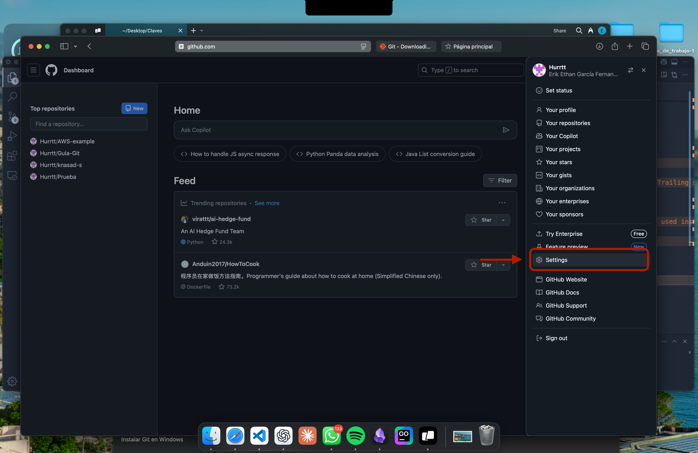
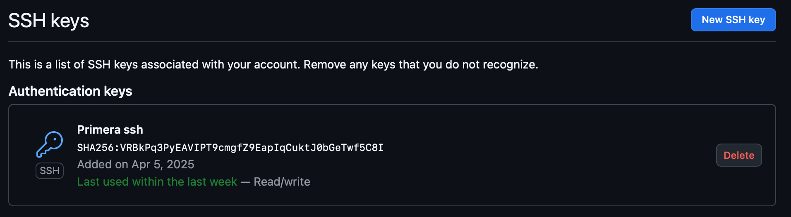
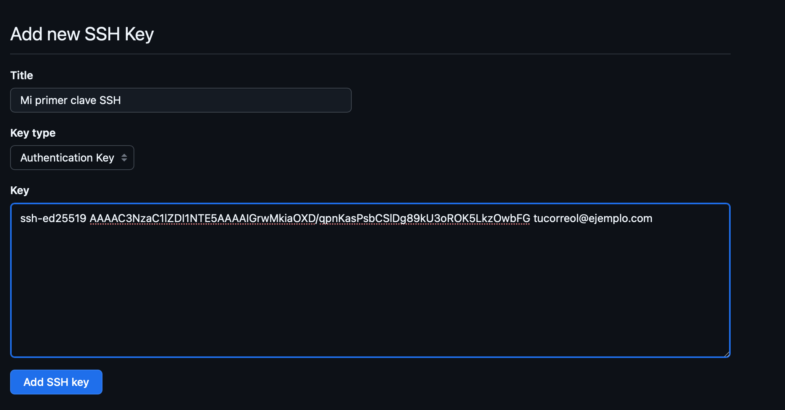

# Guia de configuracion de claves SSH

**1-Creacion de claves SSH**

Nos ubicaremos en nuestra terminal y ejecutaremos el siguiente comando: 

`ssh-keygen -t ed25519 -C "email-de-tu-cuenta-de-github@ejemplo.com"`

En caso de un error usamos:

`ssh-keygen -t rsa -b 4096 -C "email-de-tu-cuenta-de-github@ejemplo.com"`

Cuando te pregunte dónde guardar la clave, puedes dejar el valor por defecto (~/.ssh/id_ed25519) y presionar Enter. También puedes añadir una passphrase para mayor seguridad (o dejarla vacía).

*En caso de colocar un passphrase nos pedira introducir nuestra contraseña cada que hagamos un "git push" en este caso*

**Agregar claves al agente**

Usamos el comando:

`eval "$(ssh-agent -s)"`

Luego agregamos las llaves:

`ssh-add ~/.ssh/id_ed25519`

*Si guardaste tu clave con otro nombre, reemplaza el archivo según corresponda.*

**Copiamos la clave publica**

Usamos el siguiente comando para copiar directamente la clave publica en nuestro portapapeles: 

`clip < ~/.ssh/id_ed25519.pub`

*Si no tienes xclip o clip, también puedes abrir el archivo y copiarlo manualmente*

**Agregamos la clave a nuestra cuenta de GitHub**

Nos dirigimos a: [https://github.com/settings/keys] o en caso de no funcionar el link siguimos las siguientes instrucciones:

Busamos la seccion de claves: 

Y agregamos una clave nueva:

Le tendremos que dar un nombre a nuestra llave y pegarla en el espacio de abajo:

**Comprobar funcionamiento**

Como ultimos pasos necesitamos comprobar el correcto funcionamiento

Usaremos el comando: `ssh -T git@github.com`

Si es la primera vez que haces uso de esta clave te lanzara un mensaje parecido al siguiente:

*Are you sure you want to continue connecting (yes/no)?*

Colocaremos la palabra "yes" y si todo esta bien lanzara un mensake como el siguiente:

*Hi tu-usuario! You've successfully authenticated...*

**Ahora tus llaves estan completamente configuradas y las podras usar para clonar repositorios, conectartes remotamente, entre otras cosas**

