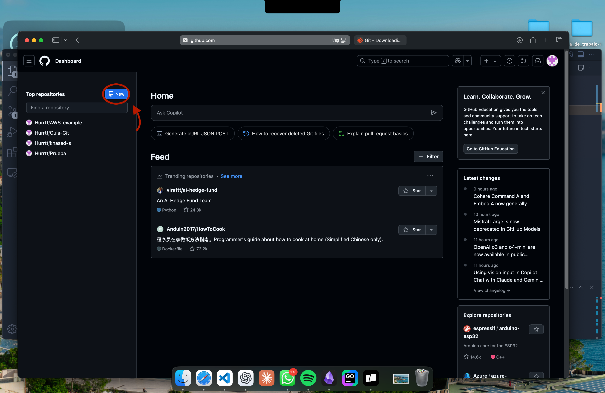
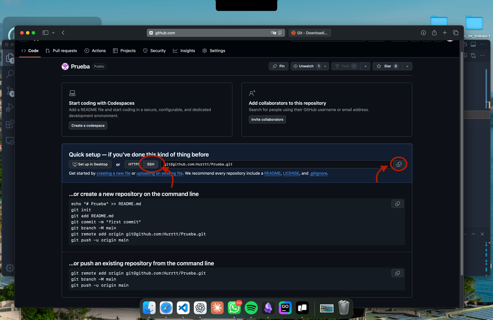

# Como crear mi primer repositorio en GitHub

Nos iremos a nuestra pagina principal en GitHub y seleccionaremos el boton azul "New":

Una vex se termine de crear debemos seleccionar la opcion "SSH" y copiaremos el link:

Esta clave se usa para conectar con nuestro repositorio de forma remota desde nuestro dispositivo.

Si quieres saber como configurar de forma remota un repositorio da click aqui:[Mi primer Repo](Primer_Repo.md)