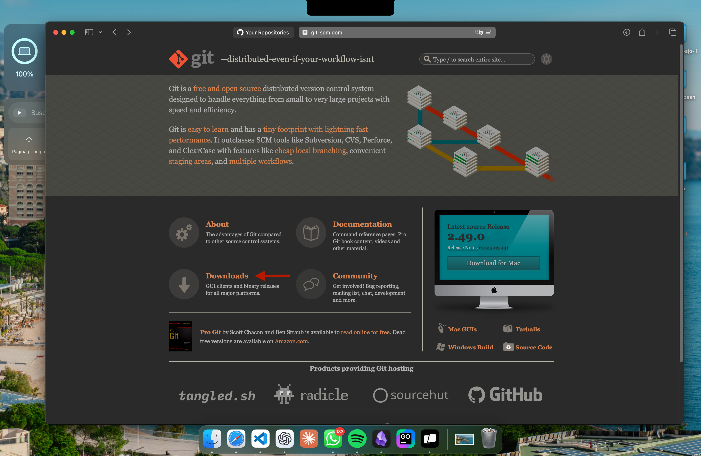
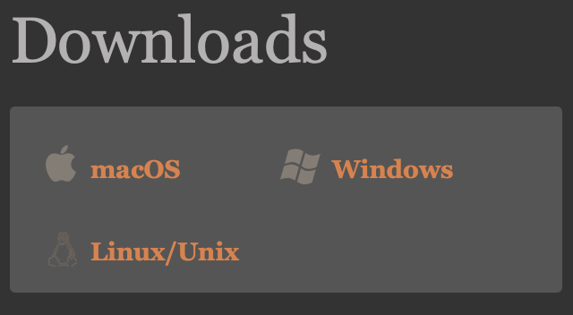

# Primeros pasos en Git

## Instalacion de git

Accedes a la pagina: [https://git-scm.com]
Seleccionamos Download: 

Seleccionamos nuestro sistema operativo y esperamos que termine la descarga: 

## Configuraciones importantes del instalador

**1.Selecciona los componentes predeterminados**
**Deja todo como está o activa:**

-Git Bash Here
-Git GUI Here

**2-Editor por defecto para Git**

Puedes dejar el predeterminado (Vim) o seleccionar Notepad++, VS Code, o cualquier editor que uses.

**3.Ajuste de nombre de la rama inicial**

Deja seleccionado:
Let Git decide (o selecciona main si quieres estandarizar).

**4.PATH environment**

Elige:
“Git from the command line and also from 3rd-party software”
(Esto te permite usar Git desde la terminal de Windows).

**5.Transport HTTPS**

Elige: Use the OpenSSL library

**6.Configuración de fin de línea (line endings)**

Elige: Checkout Windows-style, commit Unix-style line endings
	
**7.Terminal por defecto**

Elige: Use MinTTY (interfaz moderna para Git Bash).

**8.Configuración extra**

Puedes dejar estas opciones por defecto:

-Enable file system caching 

-Enable Git Credential Manager 

**9.Instalar**
Haz clic en Install.

## Comprobamos la instalacion en la terminal Git-Bash

**Abrimos nuestra app Git Bash**

colocamos el siguiente comando: `git --version`

Resultado esperado: `git version 2.43.0.windows.1`

## Configuracio inicial 

Introducimos nuestro username de GitHub 

`git config --global user.name "Tu Username"`

Introducimos el correo de nuestra cuenta de Github 

`git config --global user.email "tucorreo@ejemplo.com"`

Verificamos este configuracion con: `git config --list`

## Comprobacion en CMD

comando: `git --version`